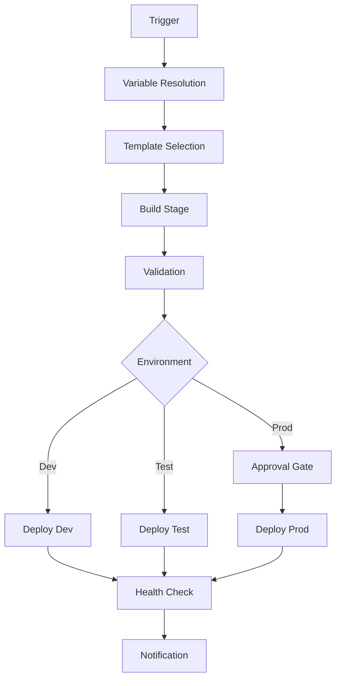
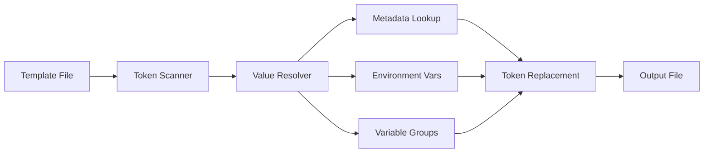
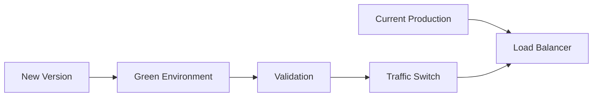
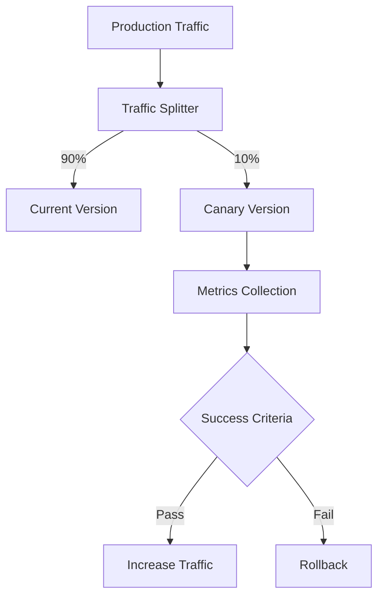
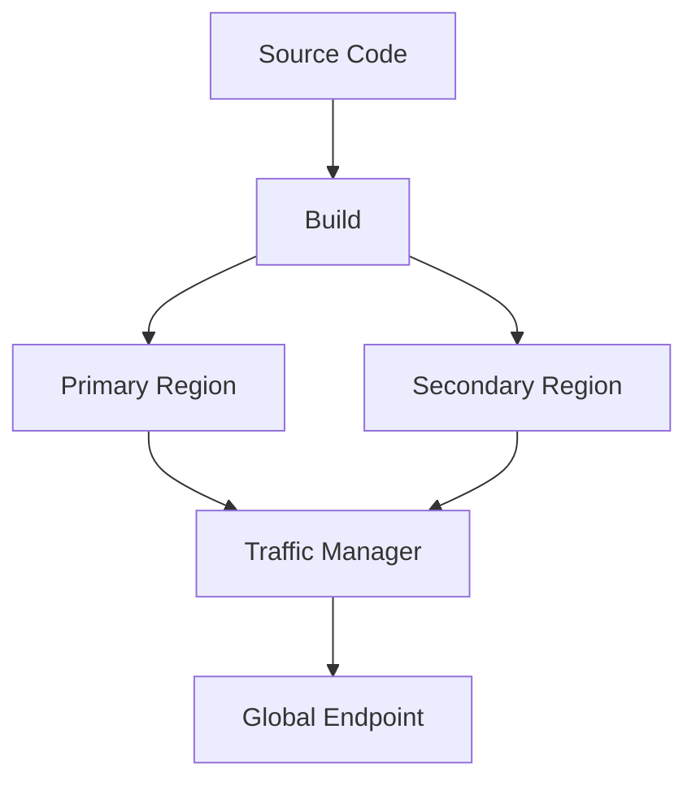

# Architecture Overview

This document provides a comprehensive overview of the Release Engine's architecture, design principles, and component interactions.

## Table of Contents

- [Architecture Overview](#architecture-overview)
- [Design Principles](#design-principles)
- [System Components](#system-components)
- [Pipeline Architecture](#pipeline-architecture)
- [Configuration Management](#configuration-management)
- [Security Architecture](#security-architecture)
- [Extensibility Model](#extensibility-model)
- [Integration Patterns](#integration-patterns)
- [Deployment Patterns](#deployment-patterns)

## Architecture Overview

The Release Engine follows a modular, template-based architecture that promotes reusability, maintainability, and scalability across different deployment scenarios.

### High-Level Architecture

```
┌─────────────────────────────────────────────────────────────┐
│                    Azure DevOps                             │
│  ┌─────────────────┐  ┌─────────────────┐  ┌──────────────┐ │
│  │   Pipelines     │  │  Variable Groups │  │ Environments │ │
│  └─────────────────┘  └─────────────────┘  └──────────────┘ │
└─────────────────────────────────────────────────────────────┘
                              │
                              ▼
┌─────────────────────────────────────────────────────────────┐
│                  Release Engine                             │
│  ┌─────────────────┐  ┌─────────────────┐  ┌──────────────┐ │
│  │  Orchestrators  │  │    Templates    │  │   Scripts    │ │
│  │                 │  │                 │  │              │ │
│  │ • Workload      │  │ • Stages        │  │ • PowerShell │ │
│  │ • ALZ           │  │ • Jobs          │  │ • Bicep      │ │
│  │ • Multi-env     │  │ • Steps         │  │ • Utilities  │ │
│  └─────────────────┘  └─────────────────┘  └──────────────┘ │
└─────────────────────────────────────────────────────────────┘
                              │
                              ▼
┌─────────────────────────────────────────────────────────────┐
│                   Azure Platform                            │
│  ┌─────────────────┐  ┌─────────────────┐  ┌──────────────┐ │
│  │   Resources     │  │   Monitoring    │  │   Security   │ │
│  │                 │  │                 │  │              │ │
│  │ • Compute       │  │ • Log Analytics │  │ • Key Vault  │ │
│  │ • Storage       │  │ • App Insights  │  │ • AAD        │ │
│  │ • Networking    │  │ • Dashboards    │  │ • RBAC       │ │
│  └─────────────────┘  └─────────────────┘  └──────────────┘ │
└─────────────────────────────────────────────────────────────┘
```

## Design Principles

### 1. Modularity and Reusability

The Release Engine is built around modular components that can be combined and reused across different scenarios:

- **Template Hierarchy**: Four-level template structure (Orchestrators → Stages → Jobs → Steps)
- **Component Isolation**: Each component has a specific responsibility and clear interfaces
- **Parameterization**: Extensive use of parameters for customization without modification

### 2. Configuration-Driven Approach

All deployment behavior is controlled through configuration rather than code modification:

- **Environment-Specific Configuration**: Separate configuration per environment
- **Token Replacement**: Dynamic value substitution at deployment time
- **Feature Flags**: Enable/disable features through configuration

### 3. Infrastructure as Code

All infrastructure and deployment processes are defined as code:

- **Version Controlled**: All templates and configurations are version controlled
- **Declarative**: Bicep templates define desired state
- **Immutable**: Infrastructure changes are deployed, not modified in place

### 4. Security by Design

Security considerations are built into every layer:

- **Least Privilege**: Service principals with minimal required permissions
- **Secret Management**: Centralized secret storage and access
- **Audit Trail**: Complete audit trail of all deployments

### 5. Observability and Monitoring

Built-in monitoring and logging capabilities:

- **Pipeline Telemetry**: Detailed logging of all pipeline activities
- **Infrastructure Monitoring**: Automated monitoring setup for deployed resources
- **Performance Tracking**: Deployment performance metrics and optimization

## System Components

### Pipeline Templates

The Release Engine uses a hierarchical template structure:

```
Pipeline Templates
├── 01-orchestrators/          # High-level workflow orchestration
│   ├── alz.devops.workload.orchestrator.yml
│   └── multi-environment.orchestrator.yml
├── 02-stages/                 # Stage-level templates
│   ├── iac.build.stage.yml
│   ├── iac.deploy.stage.yml
│   └── validation.stage.yml
├── 03-jobs/                   # Job-level templates
│   ├── iac.build.job.yml
│   ├── iac.deploy.job.yml
│   └── test.job.yml
└── 04-steps/                  # Individual step templates
    ├── token-replacement.yml
    ├── bicep-deployment.yml
    └── validation.yml
```

#### Orchestrator Templates

**Purpose**: Provide complete end-to-end workflows for specific scenarios

**Key Features**:
- Multi-environment deployment coordination
- Cross-stage dependency management
- Environment-specific configuration handling
- Approval gate integration

**Example Structure**:
```yaml
# Orchestrator Template
parameters:
- name: workload
- name: environments
- name: approvalRequired

stages:
- ${{ each env in parameters.environments }}:
  - template: ../02-stages/iac.deploy.stage.yml
    parameters:
      workload: ${{ parameters.workload }}
      environment: ${{ env.name }}
      requiresApproval: ${{ env.approvalRequired }}
```

#### Stage Templates

**Purpose**: Encapsulate major pipeline phases (build, deploy, test)

**Key Features**:
- Environment isolation
- Artifact management
- Conditional execution
- Integration with Azure DevOps environments

#### Job Templates

**Purpose**: Execute specific tasks within a stage

**Key Features**:
- Agent pool management
- Variable scoping
- Parallel execution capabilities
- Error handling and retry logic

#### Step Templates

**Purpose**: Atomic operations that can be composed into jobs

**Key Features**:
- Single responsibility
- Reusable across different contexts
- Parameterized for flexibility
- Standardized error handling

### PowerShell Scripts

The Release Engine includes a comprehensive set of PowerShell scripts for common deployment tasks:

```
PowerShell Scripts
├── common/scripts/
│   ├── functions/
│   │   ├── Convert-TokensToValues.ps1
│   │   ├── Convert-TokensToValues-v2.ps1
│   │   └── Deploy-BicepTemplate.ps1
│   ├── Replace-ConfigurationFilesTokens.ps1
│   └── Deploy-AzureResource.ps1
└── templates/utilities/scripts/
    └── deployBicep.ps1
```

#### Token Replacement Engine

**Architecture**:
```
Configuration Files → Token Processor → Environment Values → Output Files
                           ↑
                    Metadata Collection
```

**Key Components**:
- **Token Parser**: Identifies tokens using configurable patterns
- **Value Resolver**: Resolves values from metadata and environment variables
- **File Processor**: Applies transformations and generates output files

**Example Flow**:
```powershell
# Input: Template file with tokens
{
  "apiUrl": "#{apiBaseUrl}#",
  "environment": "#{environment}#"
}

# Metadata Collection
@{
  "apiBaseUrl" = "https://api-myapp-dev.azurewebsites.net"
  "environment" = "dev"
}

# Output: Processed configuration
{
  "apiUrl": "https://api-myapp-dev.azurewebsites.net",
  "environment": "dev"
}
```

### Bicep Template Management

**Architecture Pattern**:
```
Main Template → Modules → Resources
     ↓              ↓         ↓
Parameters → Module Params → Resource Properties
```

**Module Organization**:
- **Foundation Modules**: Basic Azure services (storage, networking, compute)
- **Composite Modules**: Complex scenarios combining multiple services
- **Workload Modules**: Application-specific infrastructure patterns

## Pipeline Architecture

### Execution Flow



### Stage Dependencies

Stages can have complex dependency relationships:

```yaml
stages:
# Build - No dependencies
- stage: Build
  
# Deploy Dev - Depends on Build
- stage: DeployDev
  dependsOn: Build
  
# Deploy Test - Depends on Dev success
- stage: DeployTest
  dependsOn: DeployDev
  condition: succeeded()
  
# Deploy Prod - Depends on Test and branch condition
- stage: DeployProd
  dependsOn: DeployTest
  condition: and(succeeded(), eq(variables['Build.SourceBranch'], 'refs/heads/main'))
```

### Parallel Execution

The architecture supports parallel execution where appropriate:

```yaml
stages:
- stage: Build
  
# These can run in parallel
- stage: DeployRegion1
  dependsOn: Build
  
- stage: DeployRegion2
  dependsOn: Build
  
# This waits for both regions
- stage: ConfigureGlobalServices
  dependsOn: 
  - DeployRegion1
  - DeployRegion2
```

## Configuration Management

### Configuration Hierarchy

```
Configuration Management
├── Global Configuration
│   ├── Common variables
│   ├── Shared templates
│   └── Standard policies
├── Environment Configuration
│   ├── Environment-specific values
│   ├── Service connections
│   └── Approval requirements
└── Workload Configuration
    ├── Application-specific settings
    ├── Resource parameters
    └── Feature flags
```

### Configuration Sources

The Release Engine pulls configuration from multiple sources with a defined precedence:

1. **Pipeline Parameters** (Highest precedence)
2. **Variable Groups**
3. **Environment Variables**
4. **Metadata Files**
5. **Default Values** (Lowest precedence)

### Token Resolution Process



## Security Architecture

### Authentication and Authorization

```
Security Layers
├── Azure Active Directory
│   ├── Service Principals
│   ├── Managed Identities
│   └── User Identities
├── Azure DevOps
│   ├── Project Permissions
│   ├── Pipeline Permissions
│   └── Environment Approvals
└── Azure Resources
    ├── RBAC Assignments
    ├── Resource Policies
    └── Network Security
```

### Secret Management

**Azure Key Vault Integration**:
```yaml
# Secret retrieval in pipeline
- task: AzureKeyVault@2
  inputs:
    azureSubscription: 'service-connection'
    KeyVaultName: 'kv-secrets-$(environment)'
    SecretsFilter: 'DatabasePassword,ApiKey'
    RunAsPreJob: true
```

**Variable Group Security**:
- Environment-specific variable groups
- Secret variables for sensitive data
- Access control at group level

### Network Security

**Deployment Agent Security**:
- Private agent pools for sensitive environments
- Network isolation for production deployments
- VPN or private endpoint connectivity

## Extensibility Model

### Template Extensibility

The Release Engine supports multiple extension patterns:

#### 1. Template Inheritance

```yaml
# Base template
parameters:
- name: baseParam
- name: customParam

extends:
  template: base-template.yml
  parameters:
    baseParam: ${{ parameters.baseParam }}
    
steps:
- template: custom-steps.yml
  parameters:
    customParam: ${{ parameters.customParam }}
```

#### 2. Hook Points

Templates provide hook points for custom logic:

```yaml
# Standard template with hooks
steps:
- ${{ if parameters.preDeploymentSteps }}:
  - ${{ each step in parameters.preDeploymentSteps }}:
    - ${{ step }}

- template: standard-deployment.yml

- ${{ if parameters.postDeploymentSteps }}:
  - ${{ each step in parameters.postDeploymentSteps }}:
    - ${{ step }}
```

#### 3. Plugin Architecture

Custom scripts can be integrated as plugins:

```yaml
parameters:
- name: customScripts
  type: object
  default: []

steps:
- ${{ each script in parameters.customScripts }}:
  - task: PowerShell@2
    displayName: 'Execute ${{ script.name }}'
    inputs:
      filePath: '${{ script.path }}'
      arguments: '${{ script.arguments }}'
```

### Custom Script Integration

**Script Interface Contract**:
```powershell
param(
    [Parameter(Mandatory)]
    [string]$Environment,
    
    [Parameter(Mandatory)]
    [hashtable]$Configuration,
    
    [Parameter()]
    [hashtable]$CustomParameters = @{}
)

# Script implementation
# Must return structured output for pipeline consumption
return @{
    Success = $true
    Message = "Custom script executed successfully"
    Outputs = @{
        # Custom outputs
    }
}
```

## Integration Patterns

### Azure DevOps Integration

**Service Connection Management**:
```yaml
# Environment-specific service connections
variables:
- name: serviceConnection
  value: $[
    if(eq(variables['environment'], 'prod'), 
       'azure-connection-prod', 
       'azure-connection-dev')
  ]
```

**Environment Integration**:
- Automatic environment creation
- Approval workflow integration
- Deployment history tracking

### External System Integration

**Webhook Integration**:
```yaml
# Notification hooks
- task: InvokeRESTAPI@1
  inputs:
    connectionType: 'connectedServiceName'
    serviceConnection: 'teams-webhook'
    method: 'POST'
    body: |
      {
        "text": "Deployment completed for $(workload) in $(environment)",
        "status": "$(Agent.JobStatus)"
      }
```

**Third-Party Tool Integration**:
- Security scanning tools
- Performance monitoring
- Compliance reporting
- Change management systems

## Deployment Patterns

### Blue-Green Deployment



**Implementation**:
- Parallel environment deployment
- Health check validation
- Automated traffic switching
- Rollback capabilities

### Canary Deployment



**Implementation**:
- Progressive traffic routing
- Real-time monitoring
- Automated decision making
- Gradual rollout

### Multi-Region Deployment



**Implementation**:
- Parallel region deployment
- Traffic management configuration
- Cross-region failover
- Data replication

## Performance and Scalability

### Pipeline Performance

**Optimization Strategies**:
- Parallel job execution
- Artifact caching
- Incremental deployments
- Resource pooling

**Performance Metrics**:
- Pipeline execution time
- Resource provisioning time
- Deployment success rate
- Recovery time objectives

### Scalability Considerations

**Horizontal Scaling**:
- Agent pool scaling
- Parallel environment deployment
- Multi-region distribution

**Vertical Scaling**:
- Agent capability enhancement
- Resource size optimization
- Caching strategies

## Monitoring and Observability

### Pipeline Telemetry

```yaml
# Built-in monitoring
variables:
  system.debug: true
  
steps:
- task: PowerShell@2
  displayName: 'Log Deployment Metrics'
  inputs:
    targetType: 'inline'
    script: |
      Write-Host "##vso[task.logissue type=telemetry]DeploymentStart"
      # Deployment logic
      Write-Host "##vso[task.logissue type=telemetry]DeploymentComplete"
```

### Infrastructure Monitoring

**Automated Monitoring Setup**:
- Application Insights configuration
- Log Analytics workspace setup
- Alert rule deployment
- Dashboard creation

**Key Metrics**:
- Deployment frequency
- Lead time for changes
- Mean time to recovery
- Change failure rate

This architecture provides a solid foundation for scalable, maintainable, and secure CI/CD implementations while remaining flexible enough to adapt to various organizational needs and deployment scenarios.