# Release Engine Technical Design Document

**Document Version**: 1.0  
**Last Updated**: 2025-10-21  
**Status**: Draft  
**Project**: Release Engine - CI/CD Automation Platform

## Open Questions & Needed Confirmations

- {Placeholder: Security compliance requirements (BIO/GDPR/NIS2/ISO27001) - needs stakeholder validation}
- {Placeholder: Production environment SLA requirements and scaling targets - awaiting business requirements}
- {Placeholder: Integration with organizational Entra ID and existing RBAC - needs IAM team coordination}
- {Placeholder: Network security requirements and firewall rules - needs network security team review}
- {Placeholder: Disaster recovery RTO/RPO requirements - needs business continuity validation}
- {Placeholder: Performance benchmarks and load testing criteria - needs operational team input}

---

## Table of Contents

1. [Executive Summary](#1-executive-summary)
2. [Stakeholders & Context](#2-stakeholders--context) 
3. [Requirements](#3-requirements)
4. [Architecture](#4-architecture)
5. [Security & Compliance](#5-security--compliance)
6. [Data & Integration](#6-data--integration)
7. [Delivery & Operations](#7-delivery--operations)
8. [Availability, DR & Backup](#8-availability-dr--backup)
9. [Test Strategy](#9-test-strategy)
10. [Risks & Decisions](#10-risks--decisions)
11. [Appendices](#11-appendices)

---

## 1. Executive Summary

The Release Engine is a comprehensive three-tier CI/CD automation solution developed by The Cloud Explorers that implements the Facade Pattern to dramatically simplify Azure DevOps pipeline implementation for enterprise workloads. The solution abstracts complex deployment orchestration through three distinct repositories, enabling development teams to deploy infrastructure and applications using simple configuration files while leveraging battle-tested deployment patterns.

**Evidence**: release-engine-core/docs/Release-Engine-Solution-Architecture.md#L1-L10

### Business Value

- **Accelerated Time-to-Market**: Reduce CI/CD setup time from weeks to hours through pre-built templates
- **Standardization & Compliance**: Enforce organizational deployment standards and security controls
- **Reduced Operational Overhead**: Minimize maintenance burden through centralized pipeline logic
- **Risk Mitigation**: Battle-tested patterns reduce deployment failures and security vulnerabilities

### 1.1 Organizational Goals

| Goal | Baseline | Target | Deadline | Owner | Measurement |
|------|----------|---------|-----------|--------|-------------|
| Reduce deployment setup time | 2-4 weeks | 2-4 hours | {Placeholder} | DevOps Team | Time from project initiation to first successful deployment |
| Increase deployment success rate | {Placeholder} | 95% | {Placeholder} | Platform Team | Successful deployments / Total deployments |
| Standardize CI/CD across teams | {Placeholder} | 100% adoption | {Placeholder} | Architecture Team | Teams using Release Engine / Total teams |
| Reduce security incidents | {Placeholder} | 90% reduction | {Placeholder} | Security Team | Security incidents from deployment issues |

---

## 2. Stakeholders, Scope, and Assumptions

### 2.1 Stakeholders

| Role | Stakeholder | Interest | Contact | RACI |
|------|-------------|----------|---------|-------|
| Project Owner | {Placeholder} | Business value delivery, ROI | {Placeholder} | Accountable |
| Lead Architect | The Cloud Explorers | Technical architecture, standards | {Placeholder} | Responsible |
| DevOps Teams | {Placeholder} | Ease of use, reliability | {Placeholder} | Consulted |
| Security Team | {Placeholder} | Compliance, security controls | {Placeholder} | Consulted |
| Platform Team | {Placeholder} | Operations, maintenance | {Placeholder} | Informed |

**Evidence**: {Placeholder: CODEOWNERS file not found - needs stakeholder identification}

### 2.2 Scope

#### In Scope

| Domain | Component | Description |
|--------|-----------|-------------|
| **Systems** | Release Engine Core | Pipeline orchestrators, stages, jobs, steps |
| **Systems** | Workload Patterns | Bicep templates and deployment patterns |
| **Systems** | Configuration Layer | Environment-specific configuration management |
| **Process** | CI/CD Pipeline | Build, test, deploy automation |
| **Process** | Infrastructure as Code | Azure Bicep template deployment |
| **Data** | Configuration Data | Environment variables, parameters, metadata |
| **Interfaces** | Azure DevOps | Pipeline execution and artifact management |
| **Environments** | Development | Dev environment deployment |
| **Environments** | Test | Test environment deployment |
| **Environments** | Production | Production environment deployment |

#### Out of Scope

- Custom application code development
- Manual deployment processes
- Non-Azure cloud platforms
- Legacy system migrations

**Evidence**: release-engine-core/docs/Release-Engine-Solution-Architecture.md#L40-L70

### 2.3 Assumptions

| Assumption | Impact | Validation Plan | Owner | Due Date |
|------------|--------|-----------------|-------|----------|
| Azure DevOps available as CI/CD platform | High | Confirm organizational Azure DevOps licensing | {Placeholder} | {Placeholder} |
| Teams have basic Azure and DevOps knowledge | Medium | Training assessment and plan | {Placeholder} | {Placeholder} |
| Organizational Azure subscriptions available | High | Subscription provisioning confirmation | {Placeholder} | {Placeholder} |
| GitHub Enterprise available for repository hosting | Medium | Confirm GitHub licensing and access | {Placeholder} | {Placeholder} |

### 2.4 Dependencies

| Dependency | Type | Description | Owner | Timeline |
|------------|------|-------------|-------|----------|
| Azure Subscriptions | External | Target deployment subscriptions | Cloud Team | {Placeholder} |
| Service Principals | External | Azure DevOps service connections | Identity Team | {Placeholder} |
| GitHub Organization | External | Repository hosting and management | SCM Team | {Placeholder} |
| Network Connectivity | External | Azure DevOps to Azure connectivity | Network Team | {Placeholder} |

---

## 3. Requirements

### 3.1 Functional Requirements

| ID | Requirement | Source | Priority | Acceptance Criteria |
|----|-------------|--------|----------|-------------------|
| FR-001 | Deploy Infrastructure as Code | Business Need | Must Have | Bicep templates deploy successfully to Azure |
| FR-002 | Multi-Environment Support | Business Need | Must Have | Support dev/test/prod deployment pipeline |
| FR-003 | Template-Based Configuration | User Story | Must Have | Simple configuration files control deployments |
| FR-004 | Pipeline Orchestration | Technical Need | Must Have | Automated build → test → deploy workflow |
| FR-005 | Pattern Library | User Story | Should Have | Reusable deployment patterns for common workloads |

**Evidence**: {Placeholder: User stories/backlog not found - needs business analyst validation}

### 3.2 Non-Functional Requirements

| Category | Requirement | Target | Measurement | Evidence |
|----------|-------------|--------|-------------|----------|
| **Availability** | Pipeline uptime | 99.5% | Azure DevOps metrics | {Placeholder: SLA definition needed} |
| **Performance** | Deployment time | < 30 minutes | Pipeline execution time | {Placeholder: Performance baseline needed} |
| **Scalability** | Concurrent deployments | 50+ parallel | Azure DevOps agent capacity | {Placeholder: Load testing needed} |
| **Security** | Secure secret management | 100% Azure Key Vault | Security scan results | {Placeholder: Security requirements needed} |
| **Compliance** | Policy enforcement | 100% compliant | Azure Policy compliance | {Placeholder: Compliance framework needed} |
| **Observability** | Pipeline monitoring | Real-time visibility | Log Analytics queries | {Placeholder: Monitoring requirements needed} |

---

## 4. Architecture

### 4.1 Context Diagram

```mermaid
graph TB
    subgraph External["🌐 External Systems"]
        DevTeam["👥 Development Teams"]
        AzureDevOps["🔧 Azure DevOps"]
        Azure["☁️ Azure Platform"]
        GitHub["📚 GitHub Enterprise"]
    end
    
    subgraph ReleaseEngine["🏗️ Release Engine Solution"]
        Config["📋 Configuration Layer"]
        Pattern["🔧 Pattern Layer"] 
        Core["⚙️ Core Layer"]
    end
    
    DevTeam --> Config
    Config --> Pattern
    Pattern --> Core
    Core --> AzureDevOps
    AzureDevOps --> Azure
    
    Config <--> GitHub
    Pattern <--> GitHub
    Core <--> GitHub
    
    style ReleaseEngine fill:#276749,stroke:#38a169,stroke-width:2px,color:#ffffff
    style External fill:#4a5568,stroke:#718096,stroke-width:1px,color:#ffffff
```



**Evidence**: release-engine-core/docs/Release-Engine-Solution-Architecture.md#L13-L37

### 4.2 Logical Architecture

The Release Engine implements a three-tier architecture using the Facade Pattern:

```mermaid
graph TD
    subgraph Config["🎭 Configuration Layer (Facade)"]
        ConfigRepo["📁 release-engine-config-template"]
        ConfigFiles["📄 Simple configuration files<br/>📄 Environment variables<br/>📄 Parameter files"]
    end
    
    subgraph Abstract["🔧 Abstraction Layer"]
        PatternRepo["📁 release-engine-pattern-template"]
        Patterns["🏗️ Workload patterns<br/>📜 Bicep templates<br/>⚙️ Pipeline configurations"]
    end
    
    subgraph Core["⚙️ Core Layer"]
        CoreRepo["📁 release-engine-core"]
        Components["🎼 Pipeline orchestrators<br/>🔗 Reusable stages<br/>📜 PowerShell scripts"]
    end
    
    Config --> Abstract
    Abstract --> Core
    
    style Config fill:#2b6cb0,stroke:#3182ce,stroke-width:2px,color:#ffffff
    style Abstract fill:#805ad5,stroke:#9f7aea,stroke-width:2px,color:#ffffff
    style Core fill:#276749,stroke:#38a169,stroke-width:2px,color:#ffffff
```



**Evidence**: release-engine-core/docs/Release-Engine-Solution-Architecture.md#L13-L37

### 4.3 Component Catalog

#### 4.3.1 Core Layer Components

| Component | Purpose | Technology | Location |
|-----------|---------|------------|----------|
| **Orchestrator** | Main pipeline coordination | Azure DevOps YAML | `/common/pipelines/01-orchestrators/` |
| **Build Stage** | Infrastructure validation and build | Azure DevOps YAML | `/common/pipelines/02-stages/iac.build.stage.yml` |
| **Deploy Stage** | Multi-environment deployment | Azure DevOps YAML | `/common/pipelines/02-stages/iac.deploy.stage.yml` |
| **Token Replacement** | Configuration parameterization | PowerShell | `/common/scripts/Replace-ConfigurationFilesTokens.ps1` |

**Evidence**: 
- release-engine-core/common/pipelines/01-orchestrators/alz.devops.workload.orchestrator.yml#L1-L20

#### 4.3.2 Pattern Layer Components

| Component | Purpose | Technology | Location |
|-----------|---------|------------|----------|
| **Single Resource Pattern** | Simple single-resource deployments | Bicep + YAML | `/patterns/single_resource_pattern/` |
| **Subscription Scope Pattern** | Subscription-level deployments | Bicep + YAML | `/patterns/subscription_scope_pattern/` |
| **Multi-Stage Pattern** | Complex multi-stage deployments | Bicep + YAML | `/patterns/multi_stage_pattern/` |

**Evidence**: release-engine-pattern-template/patterns/ directory structure

### 4.4 Implementation View

#### 4.4.1 Azure Subscription Architecture


**Evidence**: {Placeholder: Subscription strategy documentation needed}

#### 4.4.2 Resource Deployment Pattern

**Evidence**: release-engine-pattern-template/patterns/multi_stage_pattern/multi_stage_pattern.prerequisite.bicep#L1-L25

The solution uses Azure Verified Modules (AVM) where available:

```bicep
module resourceGroup 'br/public:avm/res/resources/resource-group:0.4.2' = {
  name: deploymentNames.resourceGroup
  params: {
    name: resourceGroupName
    tags: tags
  }
}
```

**Evidence**: release-engine-pattern-template/patterns/multi_stage_pattern/multi_stage_pattern.prerequisite.bicep#L18-L25

#### 4.4.3 Network Architecture

{Placeholder: Network architecture details needed - requires network topology specification}

---

## 5. Security & Compliance

### 5.1 Identity & Access Management

#### 5.1.1 Azure DevOps Service Connections

The solution requires service principals for Azure deployments, configured per environment:

**Evidence**: release-engine-config-template/azure-pipelines.yml#L1-L35

```yaml
        resources:
    repositories:
        - repository: release-engine-core
            type: github
            name: thecloudexplorers/release-engine-core
            endpoint: thecloudexplorers
```

{Placeholder: Service principal configuration and RBAC assignments need documentation}

#### 5.1.2 Managed Identity Usage

{Placeholder: Managed Identity implementation strategy needed}

### 5.2 Data Protection

#### 5.2.1 Secrets Management

{Placeholder: Azure Key Vault integration and secret rotation strategy needed}

#### 5.2.2 Encryption

{Placeholder: Encryption at rest and in transit specifications needed}

### 5.3 Network Security

{Placeholder: Network security controls, private endpoints, and firewall rules needed}

### 5.4 Compliance Framework

| Regulation | Applicable | Controls | Evidence |
|------------|------------|----------|----------|
| **BIO** | {Placeholder} | {Placeholder} | {Placeholder} |
| **GDPR** | {Placeholder} | {Placeholder} | {Placeholder} |
| **NIS2** | {Placeholder} | {Placeholder} | {Placeholder} |
| **ISO27001** | {Placeholder} | {Placeholder} | {Placeholder} |

---

## 6. Data & Integration

### 6.1 Data Model

#### 6.1.1 Configuration Data Structure


**Evidence**: release-engine-config-template/_config/ directory structure

### 6.2 Integration Interfaces

#### 6.2.1 GitHub Integration

Repository references enable template inheritance:

**Evidence**: release-engine-config-template/azure-pipelines.yml#L4-L15

```yaml
resources:
  repositories:
        - repository: release-engine-core
            type: github
            name: thecloudexplorers/release-engine-core
      endpoint: thecloudexplorers
      ref: refs/tags/v1.3.0
```

#### 6.2.2 Azure DevOps Integration

Pipeline orchestration through template extension:

**Evidence**: release-engine-config-template/azure-pipelines.yml#L20-L35

---

## 7. Delivery & Operations

### 7.1 DevOps & CI/CD Pipeline

#### 7.1.1 Pipeline Architecture

```mermaid
graph LR
    subgraph Pipeline["Release Pipeline Flow"]
        Build["Build Stage<br/>• Validate Bicep<br/>• Build artifacts<br/>• Security scans"]
        
        Dev["Development<br/>• Deploy to dev<br/>• Run tests<br/>• Validate deployment"]
        
        Test["Test Environment<br/>• Deploy to test<br/>• Integration tests<br/>• Performance validation"]
        
        Prod["Production<br/>• Deploy to prod<br/>• Health checks<br/>• Monitoring setup"]
    end
    
    Build --> Dev
    Dev --> Test  
    Test --> Prod
    
    style Pipeline fill:#2d3748,stroke:#4a5568,stroke-width:2px,color:#ffffff
    style Build fill:#2b6cb0,stroke:#3182ce,stroke-width:1px,color:#ffffff
    style Dev fill:#276749,stroke:#38a169,stroke-width:1px,color:#ffffff
    style Test fill:#b7791f,stroke:#d69e2e,stroke-width:1px,color:#ffffff
    style Prod fill:#c53030,stroke:#e53e3e,stroke-width:1px,color:#ffffff
```



**Evidence**: release-engine/docs/Release-Engine-Solution-Architecture.md#L185-L220

#### 7.1.2 Quality Gates

**Evidence**: release-engine/common/pipelines/01-orchestrators/alz.devops.workload.orchestrator.yml#L1-L20

The orchestrator coordinates build and deployment stages with dependency management.

{Placeholder: Specific quality gate configuration (SAST/DAST/security scans) needs documentation}

### 7.2 Infrastructure as Code

#### 7.2.1 Bicep Template Structure

**Evidence**: release-engine-pattern-template/patterns/multi_stage_pattern/multi_stage_pattern.prerequisite.bicep#L1-L10

```bicep
metadata resources = {
  version: '0.1.0'
  author: 'Wesley Camargo'
  company: 'The Cloud Explorers'
  description: 'Deploys a resource group and a storage account.'
}
```

### 7.3 Observability

#### 7.3.1 Pipeline Monitoring

**Evidence**: release-engine/common/pipelines/01-orchestrators/alz.devops.workload.orchestrator.yml#L12-L23

Debug capabilities are built into the orchestrator for troubleshooting.

{Placeholder: Application monitoring, alerting, and dashboard configuration needed}

---

## 8. Availability, DR & Backup

### 8.1 High Availability Strategy

{Placeholder: HA requirements and multi-region deployment strategy needed}

### 8.2 Disaster Recovery

| Component | RTO Target | RPO Target | Recovery Method |
|-----------|------------|------------|-----------------|
| **Pipeline Infrastructure** | {Placeholder} | {Placeholder} | {Placeholder} |
| **Configuration Data** | {Placeholder} | {Placeholder} | GitHub backup |
| **Deployed Resources** | {Placeholder} | {Placeholder} | {Placeholder} |

### 8.3 Backup Strategy

{Placeholder: Backup scope, retention policies, and restore procedures needed}

---

## 9. Test Strategy

### 9.1 Testing Framework

| Test Level | Scope | Tools | Evidence |
|------------|-------|-------|----------|
| **Unit Tests** | PowerShell functions | Pester | {Placeholder: Test files needed} |
| **Integration Tests** | Pipeline execution | Azure DevOps | {Placeholder: Test pipelines needed} |
| **Security Tests** | SAST/DAST | {Placeholder} | {Placeholder: Security testing needed} |
| **Performance Tests** | Load testing | {Placeholder} | {Placeholder: Load testing needed} |

### 9.2 Exit Criteria

| Requirement ID | Test Coverage | Acceptance Criteria |
|----------------|---------------|-------------------|
| FR-001 | Infrastructure deployment | Bicep templates deploy without errors |
| FR-002 | Multi-environment | All environments deploy successfully |
| FR-003 | Configuration | Simple config files control deployments |

---

## 10. Risks & Decisions

### 10.1 Risk Register

| Risk ID | Risk | Impact | Likelihood | Mitigation | Owner | Date |
|---------|------|--------|------------|------------|-------|------|
| R-001 | Azure DevOps service limits | High | Medium | Implement throttling and retry logic | DevOps Team | {Placeholder} |
| R-002 | Bicep template compatibility | Medium | Low | Version pinning and testing | Architecture Team | {Placeholder} |
| R-003 | Security compliance gaps | High | Medium | Regular compliance audits | Security Team | {Placeholder} |

### 10.2 Architectural Decisions

#### ADR-001: Three-Tier Architecture Pattern

**Decision**: Implement Facade Pattern with three distinct repositories

**Rationale**: Separation of concerns, simplified user experience, maintainability

**Evidence**: release-engine/docs/Release-Engine-Solution-Architecture.md#L110-L150

#### ADR-002: Azure Verified Modules Usage

**Decision**: Prefer Azure Verified Modules (AVM) where available

**Evidence**: release-engine-pattern-template/patterns/multi_stage_pattern/multi_stage_pattern.prerequisite.bicep#L18-L25

{Placeholder: Additional ADRs needed for key architectural decisions}

---

## 11. Appendices

### Appendix 1: Not Applicable List

- Manual deployment processes (replaced by automated pipelines)
- Non-Azure cloud platforms (Azure-specific solution)
- Custom application development (infrastructure focus)

### Appendix 2: Glossary

| Term | Definition |
|------|------------|
| **AVM** | Azure Verified Modules - Microsoft-maintained Bicep modules |
| **Facade Pattern** | Design pattern providing simplified interface to complex system |
| **IaC** | Infrastructure as Code - declarative infrastructure definition |
| **Pipeline Orchestration** | Automated coordination of CI/CD pipeline stages |

### Appendix 3: References

- [Release Engine Solution Architecture](./Release-Engine-Solution-Architecture.md)
- [Azure Bicep Documentation](https://docs.microsoft.com/en-us/azure/azure-resource-manager/bicep/)
- [Azure DevOps Pipeline Documentation](https://docs.microsoft.com/en-us/azure/devops/pipelines/)
- [Azure Verified Modules](https://github.com/Azure/bicep-registry-modules)

### Appendix 4: Document Management

| Version | Date | Author | Changes |
|---------|------|--------|---------|
| 1.0 | 2025-10-21 | AI Architecture Agent | Initial TDD creation based on repository analysis |

**Evidence Sources**: All evidence references point to actual files in the Release Engine repository structure as of the current analysis.