# Release Engine Solution Architecture Documentation

## Overview

The Release Engine is a comprehensive three-tier solution developed by The Cloud Explorers that implements the Facade Pattern to simplify CI/CD pipeline implementation for Azure DevOps. The solution abstracts complexity across three distinct repositories, each serving a specific architectural layer.

## Architecture Overview

The solution follows a layered architecture pattern with clear separation of concerns:

```mermaid
graph TD
    subgraph Config["🎭 Configuration Layer (Facade)"]
        ConfigRepo["📁 release-engine-config-template"]
        ConfigFeatures["• Simple configuration files<br/>• Environment-specific variables<br/>• Pipeline triggers and basic settings"]
    end
    
    subgraph Abstract["🔧 Abstraction Layer"]
        AbstractRepo["📁 release-engine-pattern-template"]
        AbstractFeatures["• Workload patterns and templates<br/>• Infrastructure as Code (Bicep)<br/>• Pattern-specific configurations"]
    end
    
    subgraph Core["⚙️ Core Layer"]
        CoreRepo["📁 release-engine-core"]
        CoreFeatures["• Reusable pipeline components<br/>• PowerShell deployment scripts<br/>• Orchestrators, stages, jobs, and steps"]
    end
    
    Config --> Abstract
    Abstract --> Core
    
    style Config fill:#e1f5fe,stroke:#0288d1,stroke-width:2px,color:#000
    style Abstract fill:#f3e5f5,stroke:#7b1fa2,stroke-width:2px,color:#000
    style Core fill:#e8f5e8,stroke:#2e7d32,stroke-width:2px,color:#000
    style ConfigRepo fill:#b3e5fc,stroke:#0277bd,stroke-width:1px,color:#000
    style AbstractRepo fill:#e1bee7,stroke:#8e24aa,stroke-width:1px,color:#000
    style CoreRepo fill:#c8e6c9,stroke:#388e3c,stroke-width:1px,color:#000
```



## Repository Structure and Responsibilities

### 1. Core Layer: release-engine-core

**Purpose**: Foundation layer providing reusable CI/CD components and deployment scripts.

**Key Components**:

#### Pipeline Structure

- `/pipelines/01-orchestrators/` - High-level pipeline orchestration templates
- `/pipelines/02-stages/` - Reusable deployment stages (build, deploy)
- `/pipelines/03-jobs/` - Individual job definitions
- `/pipelines/04-steps/` - Atomic pipeline steps

#### Scripts and Functions

- `/common/scripts/functions/` - Reusable PowerShell functions
- `/common/scripts/Replace-ConfigurationFilesTokens.ps1` - Token replacement functionality

#### Key Files

- **pattern.orchestrator.yml.yml**: Main orchestrator that coordinates build and deploy stages
- **iac.build.stage.yml**: Infrastructure build stage template
- **iac.deploy.stage.yml**: Infrastructure deployment stage template with environment dependency logic

### 2. Abstraction Layer: release-engine-pattern-template

**Purpose**: Intermediate layer defining "how" workloads are deployed through reusable patterns.

**Structure**:

```mermaid
graph LR
    subgraph Patterns["📁 patterns/"]
        Multi["🏗️ multi_stage_pattern/<br/>⭐⭐⭐ Complex multi-stage deployments"]
        Single["📦 single_resource_pattern/<br/>⭐ Simple single-resource deployments"] 
        Subscription["🌐 subscription_scope_pattern/<br/>⭐⭐ Subscription-level deployments"]
    end
    
    style Patterns fill:#f8f9fa,stroke:#6c757d,stroke-width:2px,color:#000
    style Multi fill:#fff3cd,stroke:#856404,stroke-width:1px,color:#000
    style Single fill:#d1ecf1,stroke:#0c5460,stroke-width:1px,color:#000
    style Subscription fill:#d4edda,stroke:#155724,stroke-width:1px,color:#000
```mermaid
graph LR
    subgraph Patterns["📁 patterns/"]
        Multi["🏗️ multi_stage_pattern/<br/>⭐⭐⭐ Complex multi-stage deployments"]
        Single["📦 single_resource_pattern/<br/>⭐ Simple single-resource deployments"] 
        Subscription["🌐 subscription_scope_pattern/<br/>⭐⭐ Subscription-level deployments"]
    end
    
    style Patterns fill:#f8f9fa,stroke:#6c757d,stroke-width:2px,color:#000
    style Multi fill:#fff3cd,stroke:#856404,stroke-width:1px,color:#000
    style Single fill:#d1ecf1,stroke:#0c5460,stroke-width:1px,color:#000
    style Subscription fill:#d4edda,stroke:#155724,stroke-width:1px,color:#000
```

**Pattern Components**:

- **workload.bicep**: Infrastructure as Code defining Azure resources
- **workload.yml**: Pipeline configuration and deployment orchestration

**Pattern Features**:

- Azure Verified Modules (AVM) integration
- Dependency management between deployment stages
- Parameterized infrastructure definitions
- Environment-agnostic templates

### 3. Configuration Layer: release-engine-config-template

**Purpose**: Facade layer providing simple configuration interface for end users.

**Structure**:



```mermaid
graph TD
    subgraph ConfigRoot["📁 Configuration Repository"]
        Pipeline["📄 azure-pipelines.yml<br/>🎯 Main pipeline entry point"]
        ConfigDir["📁 _config/"]
    end
    
    subgraph ConfigDetails["📁 _config/ Structure"]
        Metadata["📄 metadata.yml<br/>⚙️ Workload metadata and global settings"]
        EnvDir["📁 environments/"]
        ParamDir["📁 parameters/"]
        
        subgraph Environments["📁 environments/"]
            DevVars["📄 vars-development.yml<br/>🔧 Development environment variables"]
            TestVars["📄 vars-test.yml<br/>🧪 Test environment variables"]  
            ProdVars["📄 vars-production.yml<br/>🏭 Production environment variables"]
        end
        
        subgraph Parameters["📁 parameters/"]
            ParamFiles["📄 *.parameters.json<br/>⚡ Bicep parameter files"]
        end
    end
    
    ConfigDir --> Metadata
    ConfigDir --> EnvDir
    ConfigDir --> ParamDir
    EnvDir --> Environments
    ParamDir --> Parameters
    
    style ConfigRoot fill:#e3f2fd,stroke:#1976d2,stroke-width:2px,color:#000
    style ConfigDetails fill:#f3e5f5,stroke:#7b1fa2,stroke-width:2px,color:#000
    style Pipeline fill:#bbdefb,stroke:#1565c0,stroke-width:1px,color:#000
    style Metadata fill:#e1bee7,stroke:#8e24aa,stroke-width:1px,color:#000
    style Environments fill:#c8e6c9,stroke:#388e3c,stroke-width:2px,color:#000
    style Parameters fill:#ffecb3,stroke:#f57c00,stroke-width:2px,color:#000
    style DevVars fill:#dcedc8,stroke:#689f38,stroke-width:1px,color:#000
    style TestVars fill:#fff9c4,stroke:#fbc02d,stroke-width:1px,color:#000
    style ProdVars fill:#ffcdd2,stroke:#d32f2f,stroke-width:1px,color:#000
    style ParamFiles fill:#ffe0b2,stroke:#f57c00,stroke-width:1px,color:#000
```

## Design Patterns and Principles

### Facade Pattern Implementation

The solution implements the Facade Pattern by:

1. **Hiding Complex Implementation**: Core pipeline logic is abstracted from end users
2. **Simplified Interface**: Users only interact with simple configuration files
3. **Consistent API**: Standardized configuration structure across all workloads
4. **Separation of Concerns**: Each layer has distinct responsibilities

### Configuration Management

#### Metadata Structure

```yaml
variables:
  landingZoneName: "patterns"
  landingZoneAbbreviation: "ptn"
  applicationName: "multi-stage-pattern-example"
  applicationAbbreviation: "msp"
  workload: multi_stage_pattern
  workload_location: westeurope
  subscriptionId: "81cb5a65-0cea-4807-8a31-eb93dffe39aa"
```

#### Environment Variables

Each environment defines specific configuration:

```yaml
# vars-development.yml
variables:
  environmentAbbreviation: dev
  workloadLocation: westeurope
```

### Pipeline Orchestration

#### Multi-Stage Deployment Flow

1. **Build Stage**: Validates and builds infrastructure templates
2. **Deploy Stages**: Sequential deployment across environments
3. **Dependency Management**: Automatic handling of inter-stage dependencies
4. **Environment Promotion**: Controlled promotion from dev → test → production

```mermaid
graph LR
    subgraph Pipeline["🔄 Release Pipeline Flow"]
        Build["🏗️ Build Stage<br/>• Validate Bicep<br/>• Build artifacts<br/>• Security scans"]
        
        Dev["🔧 Development<br/>• Deploy to dev<br/>• Run tests<br/>• Validate deployment"]
        
        Test["🧪 Test Environment<br/>• Deploy to test<br/>• Integration tests<br/>• Performance validation"]
        
        Prod["🏭 Production<br/>• Deploy to prod<br/>• Health checks<br/>• Monitoring setup"]
    end
    
    subgraph Gates["🛡️ Quality Gates"]
        DevGate["✅ Dev Gate<br/>• Deployment success<br/>• Basic tests pass"]
        TestGate["✅ Test Gate<br/>• All tests pass<br/>• Approval required"]
        ProdGate["✅ Prod Gate<br/>• Manual approval<br/>• Change board approval"]
    end
    
    Build --> Dev
    Dev --> DevGate
    DevGate --> Test
    Test --> TestGate
    TestGate --> Prod
    Prod --> ProdGate
    
    style Build fill:#e3f2fd,stroke:#1976d2,stroke-width:2px,color:#000
    style Dev fill:#e8f5e8,stroke:#2e7d32,stroke-width:2px,color:#000
    style Test fill:#fff3e0,stroke:#f57c00,stroke-width:2px,color:#000
    style Prod fill:#ffebee,stroke:#d32f2f,stroke-width:2px,color:#000
    style DevGate fill:#f1f8e9,stroke:#558b2f,stroke-width:1px,color:#000
    style TestGate fill:#fff8e1,stroke:#f9a825,stroke-width:1px,color:#000
    style ProdGate fill:#fce4ec,stroke:#c2185b,stroke-width:1px,color:#000
```



#### Stage Dependencies

```yaml
environments:
  - name: development
    dependsOn: build
    primaryEnvironment: true
  - name: test
    dependsOn: development
  - name: production
    dependsOn: test
```

## Key Features and Capabilities

### Infrastructure as Code (IaC)

- **Azure Bicep Templates**: Modern ARM template language
- **Azure Verified Modules**: Leverages Microsoft-maintained modules when available
- **Parameter Management**: Environment-specific parameter files
- **Deployment Scopes**: Support for Tenant, Subscription, and Resource Group deployments

### Pipeline Features

- **Reusable Components**: Modular pipeline templates
- **Environment Management**: Automated environment-specific deployments
- **Dependency Tracking**: Complex dependency resolution between deployment stages
- **Debug Capabilities**: Built-in debugging and troubleshooting tools

### PowerShell Integration

- **Standardized Functions**: Common deployment and utility functions
- **Error Handling**: Robust error handling and reporting
- **Token Replacement**: Dynamic configuration token replacement
- **Azure Integration**: Native Azure PowerShell module integration

## Usage Patterns

### Creating New Workloads

1. **Choose Pattern**: Select appropriate pattern from `release-engine-pattern-template`
2. **Configure Infrastructure**: Customize `workload.bicep` for specific resources
3. **Set Pipeline Logic**: Adjust `workload.yml` for deployment orchestration
4. **Create Configuration**: Set up simple configuration in dedicated configuration repository

### Configuration Repository Setup

1. **Pipeline Definition**: Single `azure-pipelines.yml` file referencing pattern templates
2. **Metadata Configuration**: Global workload settings in `metadata.yml`
3. **Environment Variables**: Environment-specific configuration files
4. **Parameter Files**: Bicep parameter files for infrastructure customization

### Development Workflow

1. **Local Development**: Test patterns and scripts locally
2. **Configuration Changes**: Update simple configuration files
3. **Automated Deployment**: Pipeline automatically handles complex orchestration
4. **Environment Promotion**: Automatic promotion through dev/test/prod pipeline

## Benefits and Advantages

### For Developers

- **Simplified Configuration**: Abstract away pipeline complexity
- **Consistent Patterns**: Standardized approach across all workloads
- **Rapid Deployment**: Quick setup of new workloads
- **Best Practices**: Built-in Azure and DevOps best practices

### For Operations

- **Centralized Management**: Single source of truth for pipeline logic
- **Standardization**: Consistent deployment patterns across organization
- **Maintainability**: Changes to core logic benefit all workloads
- **Scalability**: Easy replication for new teams and projects

### For Organizations

- **Reduced Complexity**: Lower barrier to entry for CI/CD adoption
- **Compliance**: Built-in security and governance patterns
- **Cost Efficiency**: Reduced development and maintenance overhead
- **Risk Reduction**: Tested and proven deployment patterns

## Technical Implementation Details

### Repository Integration

```yaml
# Pipeline resource references
resources:
  repositories:
    - repository: release-engine-core
      type: github
      name: thecloudexplorers/release-engine-core
    - repository: workload
      type: github
      name: thecloudexplorers/release-engine-pattern-template
```

### Template Inheritance

```yaml
# Configuration extends pattern template
extends:
  template: /patterns/multi_stage_pattern/workload.yml@workload
  parameters:
    platformWorkloadSettings:
      configurationFilePath: /_config
      environments: [development, test, production]
```

### Dynamic Stage Generation

The orchestrator dynamically generates deployment stages based on:

- Environment configuration
- Stage dependencies
- Deployment scope requirements
- Service connection settings

## Security and Governance

### Service Principal Management

- Environment-specific service principals
- Least privilege access patterns
- Automated credential management

### Compliance Features

- Azure Policy integration
- Resource tagging standards
- Audit trail maintenance
- Environment isolation

## Future Extensibility

### Pattern Development

- Template for creating new patterns
- Azure Verified Module integration guidelines
- Testing and validation frameworks

### Configuration Evolution

- Backward compatibility maintenance
- Configuration schema versioning
- Migration tooling and guidance

## Template Repository Management

The Release Engine solution uses a template-based approach where the **abstraction layer** and **configuration layer** repositories serve as templates that teams clone and adapt for their specific needs.

### Template Repositories

#### 1. Workload Pattern Template Repository
**Repository**: `release-engine-pattern-template`
**Purpose**: Template for creating new workload pattern repositories
**Usage**: Clone this repository to create your own workload patterns

#### 2. Configuration Template Repository
**Repository**: `release-engine-config-template`
**Purpose**: Template for creating new configuration repositories
**Usage**: Clone this repository for each workload you want to deploy

### Getting Started with Templates

#### Step 1: Clone the Workload Pattern Template

```bash
# Clone the workload pattern template
git clone https://github.com/thecloudexplorers/release-engine-pattern-template.git
cd release-engine-pattern-template

# Rename the repository for your organization
# Example: release-engine-myorg-workload-patterns
```

#### Step 2: Clone the Configuration Template

```bash
# Clone the configuration template for your specific workload
git clone https://github.com/thecloudexplorers/release-engine-config-template.git
cd release-engine-config-template

# Rename the repository for your workload
# Example: release-engine-myapp-storage-configuration
```

#### Step 3: Set Up Upstream Repository

After cloning, configure the upstream repository to receive updates:

```bash
# Add upstream remote (for both template repositories)
git remote add upstream https://github.com/thecloudexplorers/[original-template-repo].git

# Verify remotes
git remote -v
# origin    https://github.com/yourorg/your-repo.git (fetch)
# origin    https://github.com/yourorg/your-repo.git (push)
# upstream  https://github.com/thecloudexplorers/[template-repo].git (fetch)
# upstream  https://github.com/thecloudexplorers/[template-repo].git (push)
```

### Working with Upstream Updates

#### Syncing with Upstream Changes

Regularly sync your repository with upstream improvements:

```bash
# Fetch upstream changes
git fetch upstream

# Create a new branch for upstream integration
git checkout -b sync-upstream-YYYYMMDD

# Merge upstream changes
git merge upstream/main

# Resolve any conflicts and test changes
# Commit and push to your branch
git push origin sync-upstream-YYYYMMDD

# Create pull request to merge into your main branch
```

#### Best Practices for Upstream Management

1. **Regular Syncing**: Sync with upstream monthly or when new features are released
2. **Branch Strategy**: Always use feature branches for upstream integration
3. **Conflict Resolution**: Carefully review and test all conflict resolutions
4. **Documentation**: Document any custom modifications that differ from upstream
5. **Testing**: Thoroughly test your workloads after upstream integration

### Contributing to Upstream Templates

#### When to Contribute Back

Consider contributing when you:

- Fix bugs in the template repositories
- Add new workload patterns that could benefit others
- Improve documentation or examples
- Enhance PowerShell scripts or pipeline logic

#### Contribution Process

1. **Fork the Upstream Repository**
    ```bash
    # Fork on GitHub, then clone your fork
    git clone https://github.com/yourusername/release-engine-pattern-template.git
    ```

2. **Create Feature Branch**
   ```bash
   git checkout -b feature/your-improvement-name
   ```

3. **Make Changes and Test**
   - Follow the existing code standards
   - Test your changes thoroughly
   - Update documentation as needed

4. **Submit Pull Request**
   - Create descriptive pull request to upstream repository
   - Include rationale and testing evidence
   - Follow the repository's contribution guidelines

#### Contribution Guidelines

- **Code Standards**: Follow existing PowerShell and YAML formatting
- **Documentation**: Update relevant documentation for any changes
- **Testing**: Include evidence that changes work as expected
- **Backward Compatibility**: Ensure changes don't break existing implementations
- **Security**: Follow security best practices for any new patterns

### Repository Links and Examples

#### Core Repository
- **[release-engine-core](https://github.com/thecloudexplorers/release-engine-core)** - Core pipeline components and orchestrators

#### Template Repositories
- **[release-engine-pattern-template](https://github.com/thecloudexplorers/release-engine-pattern-template)** - Workload pattern template
- **[release-engine-config-template](https://github.com/thecloudexplorers/release-engine-config-template)** - Configuration template

#### Cloud Explorer Workload Examples

The following repositories demonstrate real-world implementations using the Release Engine templates:

##### Platform Workloads
- **release-engine-platform-logging** - Centralized logging infrastructure
- **release-engine-platform-monitoring** - Monitoring and alerting patterns
- **release-engine-platform-networking** - Network infrastructure patterns
- **release-engine-platform-security** - Security and compliance patterns

##### Application Workloads
- **release-engine-app-webapp** - Azure Web App deployment patterns
- **release-engine-app-function** - Azure Functions deployment patterns
- **release-engine-app-containerapp** - Container Apps deployment patterns
- **release-engine-app-storage** - Storage account deployment patterns

##### Data Workloads
- **release-engine-data-sqldb** - SQL Database deployment patterns
- **release-engine-data-cosmosdb** - Cosmos DB deployment patterns
- **release-engine-data-synapse** - Synapse Analytics patterns
- **release-engine-data-datafactory** - Data Factory deployment patterns

### Template Customization Guidelines

#### Workload Pattern Customization

When customizing the workload pattern template:

1. **Pattern Structure**: Maintain the `/patterns/[pattern-name]/` structure
2. **Required Files**: Always include `workload.bicep` and `workload.yml`
3. **Naming Convention**: Use descriptive pattern names (e.g., `webapp_with_database`)
4. **Documentation**: Include README.md for each pattern explaining usage
5. **Parameters**: Use consistent parameter naming across patterns

#### Configuration Repository Customization

When customizing the configuration template:

1. **Repository Naming**: Use format `release-engine-[workload-name]-configuration`
2. **Environment Structure**: Maintain the `/_config/environments/` structure
3. **Metadata**: Update `metadata.yml` with workload-specific information
4. **Parameters**: Customize Bicep parameter files for your infrastructure needs
5. **Pipeline**: Update `azure-pipelines.yml` to reference your workload patterns

### Maintenance and Lifecycle Management

#### Version Management

- **Semantic Versioning**: Use semantic versioning for your template repositories
- **Release Tags**: Tag releases to enable specific version references
- **Change Documentation**: Maintain CHANGELOG.md for tracking modifications
- **Breaking Changes**: Clearly communicate any breaking changes to consumers

#### Repository Lifecycle

1. **Initial Setup**: Clone templates and customize for your needs
2. **Development**: Create workloads using your customized templates  
3. **Maintenance**: Regular upstream synchronization and testing
4. **Evolution**: Continuous improvement and pattern expansion
5. **Retirement**: Graceful deprecation process for outdated patterns

## Conclusion

The Release Engine solution successfully implements a sophisticated three-layer architecture using the Facade Pattern to dramatically simplify CI/CD pipeline implementation while maintaining enterprise-grade capabilities. By abstracting complexity across dedicated repositories, it enables teams to focus on business logic while leveraging battle-tested deployment patterns and infrastructure as code practices.

The solution demonstrates how proper architectural patterns can transform complex DevOps implementations into simple, maintainable, and scalable solutions that benefit developers, operations teams, and organizations alike.
