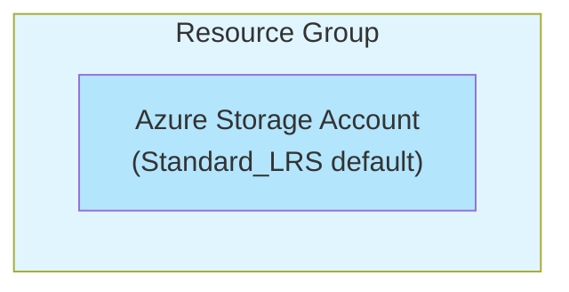

# Resource Group Scope Pattern

## Overview
The Resource Group Scope Pattern is the simplest deployment pattern in the Release Engine framework. It demonstrates how to deploy a single Azure resource (storage account) within a resource group using Azure Verified Modules (AVM) with minimal configuration.

## Architecture
This pattern deploys a single Azure Storage Account within an existing Resource Group.



## Prerequisites
- **Azure Permissions**: Contributor access to target Resource Group
- **Service Principal**: Configured with appropriate permissions for storage account creation
- **Resource Group**: Must exist before deployment (not created by this pattern)

## Resources Created
- **Azure Storage Account** (AVM: `avm/res/storage/storage-account:0.27.1`)
  - Uses Azure Verified Modules for best practices and security
  - Configurable location and name
  - Default SKU can be overridden via parameters

## Parameters

| Parameter | Type | Description | Default | Required |
|-----------|------|-------------|---------|----------|
| `resourceLocation` | string | Azure region for deployment | None | Yes |
| `storageAccountName` | string | Name of the storage account | None | Yes |

### Parameter Constraints
- **`resourceLocation`**: Must be one of: `westeurope`, `uksouth`
- **`storageAccountName`**: Must follow Azure storage account naming rules (3-24 characters, lowercase, numbers only)

## Outputs

| Output | Type | Description |
|--------|------|-------------|
| `storageAccountId` | string | Resource ID of the created storage account |

## Deployment Scope
- **Target Scope**: Resource Group
- **Service Connection Required**: Yes
- **Multi-Stage**: No (single deployment stage)

## Pipeline Configuration

### Stage Configuration
```yaml
stages:
  - infrastructure:
      iac:
        name: single_resource_deployment
        deploymentScope: ResourceGroup
        serviceConnection: $(serviceConnection)
        iacMainFileName: resource_group_scope_pattern.bicep
        iacParameterFileName: ${{ parameters.deploymentSettings.iacParameterFileName }}
```

### Environment Variables Required
The pattern expects these variables to be defined in your configuration repository:

```yaml
# In vars-{environment}.yml
variables:
  storageAccountSku: Standard_LRS  # or Standard_GRS for production
  resourceLocation: westeurope     # or your preferred region
```

## Configuration Repository Integration

### Parameter File Example (`resource_group_scope_pattern.parameters.json`)
```json
{
  "$schema": "https://schema.management.azure.com/schemas/2019-04-01/deploymentParameters.json#",
  "contentVersion": "1.0.0.0",
  "parameters": {
    "resourceLocation": {
      "value": "#{resourceLocation}#"
    },
    "storageAccountName": {
      "value": "st#{applicationAbbreviation}#{environmentAbbreviation}#{uniqueString}#"
    }
  }
}
```

### Metadata Configuration
```yaml
# In _config/metadata.yml
variables:
  workload: "resource_group_scope_pattern"  # Must match pattern name
  applicationAbbreviation: "myapp"     # Used in storage account naming
```

## Usage Examples

### Development Environment
```yaml
# vars-development.yml
variables:
  environmentAbbreviation: dev
  resourceLocation: westeurope
  storageAccountSku: Standard_LRS  # Cost-effective for development
```

### Production Environment
```yaml
# vars-production.yml
variables:
  environmentAbbreviation: prd
  resourceLocation: westeurope
  storageAccountSku: Standard_GRS  # Geo-redundant for production
```

## Security Considerations
- **Azure Verified Modules**: Uses official Microsoft-maintained modules with security best practices
- **Managed Identity**: Storage account supports system-assigned managed identity (configurable via AVM parameters)
- **Encryption**: Encryption at rest enabled by default through AVM
- **Network Access**: Default configuration allows public access (can be restricted via AVM parameters)

## Cost Optimization
- **Development**: Use `Standard_LRS` for lower costs
- **Production**: Consider `Standard_GRS` for geo-redundancy
- **Hot/Cool Tiers**: Configure access tiers based on usage patterns
- **Lifecycle Management**: Implement lifecycle policies for automatic tier transitions

## Monitoring and Diagnostics
The storage account created by this pattern supports:
- **Azure Monitor Integration**: Metrics and logs automatically available
- **Diagnostic Settings**: Can be configured post-deployment
- **Application Insights**: Integration available for application-level monitoring
- **Cost Monitoring**: Built-in cost tracking and budgets

## Troubleshooting

### Common Issues

#### Storage Account Name Conflicts
**Problem**: Storage account name already exists globally
**Solution**: Ensure `storageAccountName` includes unique suffixes like environment abbreviations

#### Permission Errors
**Problem**: Deployment fails with permission denied
**Solution**: Verify service principal has Contributor role on target Resource Group

#### Region Availability
**Problem**: Deployment fails due to region restrictions
**Solution**: Ensure selected region supports storage accounts and is in allowed list

### Validation Commands
```bash
# Validate Bicep template
az bicep build --file resource_group_scope_pattern.bicep

# Test deployment (what-if)
az deployment group what-if \
  --resource-group myResourceGroup \
  --template-file resource_group_scope_pattern.bicep \
  --parameters resourceLocation=westeurope storageAccountName=mystorageaccount
```

## Pattern Evolution
This pattern serves as the foundation for more complex patterns. Consider graduating to:
- **Multi Resource Pattern**: When you need multiple related resources
- **Multi Stage Pattern**: When you need complex dependencies
- **Application Pattern**: When deploying full applications with storage dependencies

## Maintenance Notes
- **AVM Updates**: Regularly update to latest AVM versions for security patches
- **Parameter Validation**: Add additional parameter validation as requirements evolve
- **Output Enhancement**: Add more outputs as downstream consumers require additional information

## Related Patterns
- **Multi Stage Pattern**: Complex deployments with dependencies
- **Subscription Scope Pattern**: Subscription-level resource creation
- **Application Patterns**: Full application stacks including storage

---

*This pattern demonstrates the simplest deployment scenario and serves as an excellent starting point for teams new to the Release Engine framework.*