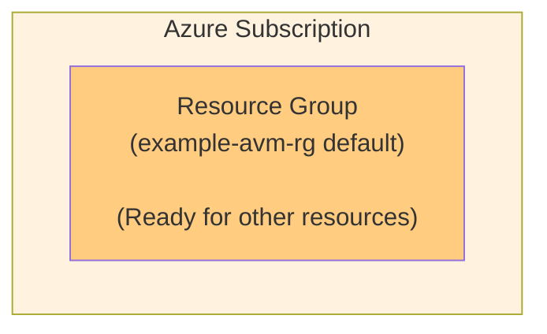

# Subscription Scope Pattern

## Overview

The Subscription Scope Pattern demonstrates how to deploy resources at the Azure subscription level using the Release Engine framework. This pattern creates a Resource Group, which serves as a foundation for other resources and patterns.

## Architecture

This pattern deploys a Resource Group at the subscription level, which can then host other Azure resources.



## Prerequisites

- **Azure Permissions**: Owner or Contributor access at subscription level
- **Service Principal**: Configured with subscription-level permissions
- **Subscription Access**: Active Azure subscription with sufficient quotas

## Resources Created

- **Azure Resource Group** (AVM: `avm/res/resources/resource-group:0.4.2`)
  - Uses Azure Verified Modules for consistent naming and tagging
  - Configurable name and tags
  - Foundation for other resource deployments

## Parameters

| Parameter | Type | Description | Default | Required |
|-----------|------|-------------|---------|----------|
| `tags` | object | Tags to apply to the resource group | `{}` | No |
| `resourceGroupName` | string | Name of the resource group | `example-avm-rg` | No |

### Parameter Constraints

- **`resourceGroupName`**: Must follow Azure resource group naming conventions
- **`tags`**: Standard Azure tagging format (key-value pairs)

## Outputs

| Output | Type | Description |
|--------|------|-------------|
| `resourceGroupId` | string | Resource ID of the created resource group |

## Deployment Scope

- **Target Scope**: Subscription
- **Service Connection Required**: Yes (subscription-level permissions)
- **Multi-Stage**: No (single deployment stage)

## Pipeline Configuration

### Using the Pattern Template

To use this pattern in a pipeline, extend the template from your configuration repository:

```yaml
extends:
  template: /patterns/templates/iac/subscription_scope_pattern/deployment-pattern.yml@workload
  parameters:
    deploymentSettings:
      configurationFilePath: /_config
      environments: [development, test, production]
```

When testing inside the `release-engine-core` repository (internal pipelines), set the context explicitly to ensure paths resolve correctly:

```yaml
extends:
  template: /patterns/templates/iac/subscription_scope_pattern/deployment-pattern.yml@workload
  parameters:
    deploymentSettings:
      configurationFilePath: /_config
      environments: [development, test, production]
      configurationPipelineContext: internal  # options: internal | external (default)
```

### Stage Configuration

```yaml
stages:
  - infrastructure:
      iac:
        name: subscription_deployment
        deploymentScope: Subscription
        serviceConnection: $(serviceConnection)
        iacMainFileName: subscription_scope_pattern.bicep
        iacParameterFileName: ${{ parameters.deploymentSettings.iacParameterFileName }}
```

### Environment Variables Required

The pattern expects these variables to be defined in your configuration repository:

```yaml
# In vars-{environment}.yml
variables:
  subscriptionId: "<your-subscription-guid>"
  resourceGroupName: "rg-myapp-#{environmentAbbreviation}#"
  commonTags:
    Environment: "#{environmentAbbreviation}#"
    Owner: "#{primary_owner}#"
    CostCenter: "#{cost_center}#"
```

## Configuration Repository Integration

### Parameter File Example (`subscription_scope_pattern.parameters.json`)

```json
{
  "$schema": "https://schema.management.azure.com/schemas/2019-04-01/deploymentParameters.json#",
  "contentVersion": "1.0.0.0",
  "parameters": {
    "resourceGroupName": {
      "value": "rg-#{applicationName}#-#{environmentAbbreviation}#"
    },
    "tags": {
      "value": {
        "Environment": "#{environmentAbbreviation}#",
        "Application": "#{applicationName}#",
        "Owner": "#{primary_owner}#",
        "CostCenter": "#{cost_center}#",
        "Workload": "#{workload}#"
      }
    }
  }
}
```

### Metadata Configuration

```yaml
# In _config/metadata.yml
variables:
  workload: "subscription_scope_pattern"  # Must match pattern name
  applicationName: "myapplication"        # Used in resource group naming
  primary_owner: "team@company.com"       # For tagging
  cost_center: "IT-001"                   # For cost tracking
```

## Usage Examples

### Development Environment

```yaml
# vars-development.yml
variables:
  environmentAbbreviation: dev
  resourceGroupName: "rg-myapp-dev"
  enableDiagnostics: true
```

### Production Environment

```yaml
# vars-production.yml  
variables:
  environmentAbbreviation: prd
  resourceGroupName: "rg-myapp-prd"
  enableDiagnostics: true
  enableBackup: true
```

## Security Considerations

- **Azure Verified Modules**: Uses official Microsoft-maintained modules
- **RBAC Ready**: Resource group created with proper structure for role assignments
- **Tagging Strategy**: Consistent tagging for governance and cost management
- **Audit Trail**: All operations logged at subscription level

## Cost Optimization

- **Resource Group**: No direct cost for resource group creation
- **Tagging Strategy**: Enables cost allocation and tracking
- **Resource Policies**: Foundation for implementing cost governance policies
- **Budget Integration**: Resource group can be used for budget scoping

## Monitoring and Diagnostics

The resource group supports:

- **Activity Logs**: Automatic logging of all resource group operations
- **Resource Health**: Monitoring of resources within the group
- **Policy Compliance**: Foundation for Azure Policy enforcement
- **Cost Analysis**: Grouping costs by resource group

## Troubleshooting

### Common Issues

#### Insufficient Permissions
 
**Problem**: Deployment fails with authorization errors  
**Solution**: Ensure service principal has Contributor access at subscription level

#### Resource Group Already Exists
 
**Problem**: Resource group name conflicts  
**Solution**: Use unique naming patterns with environment suffixes

#### Subscription Quota
 
**Problem**: Subscription limits reached  
**Solution**: Check subscription quotas and request increases if needed

### Validation Commands

```bash
# Validate Bicep template
az bicep build --file subscription_scope_pattern.bicep

# Test deployment (what-if)
az deployment sub what-if \
  --location westeurope \
  --template-file subscription_scope_pattern.bicep \
  --parameters resourceGroupName=test-rg tags='{"Environment":"test"}'
```

## Pattern Evolution

This pattern serves as a foundation for more complex patterns:

- **Multi-Resource Pattern**: Deploy multiple resources within the created resource group
- **Multi-Stage Pattern**: Create resource group first, then deploy dependent resources
- **Platform Pattern**: Create multiple resource groups for different tiers

## Use Cases

### Platform Foundation
 
- Creating standardized resource groups for platform services
- Establishing naming conventions and tagging strategies
- Preparing for multi-tier application deployments

### Environment Setup
 
- Creating environment-specific resource groups
- Setting up development, test, and production boundaries
- Preparing for resource isolation and governance

### Cost Management
 
- Establishing cost centers and billing boundaries
- Creating resource groups for different departments or projects
- Enabling detailed cost allocation and budgeting

## Integration with Other Patterns

### As Prerequisite
 
This pattern often serves as a prerequisite for:
 
- Single Resource Pattern (needs existing resource group)
- Application Patterns (foundation for app resources)
- Data Patterns (resource group for data services)

### In Multi-Stage Deployments
 
```yaml
# Example multi-stage with prerequisite
stages:
  # First stage: Create resource group
  - infrastructure:
      iac:
        name: foundation_stage
        deploymentScope: Subscription
        iacMainFileName: subscription_scope_pattern.bicep
        
  # Second stage: Deploy resources into the group
  - infrastructure:
      iac:
        name: resources_stage
        deploymentScope: ResourceGroup
        iacMainFileName: application_resources.bicep
        dependsOn: foundation_stage
```

## Maintenance Notes

- **AVM Updates**: Monitor for updates to resource group AVM module
- **Tagging Evolution**: Update tagging strategy as governance requirements evolve
- **Naming Conventions**: Maintain consistency across all resource groups
- **Policy Alignment**: Ensure resource group creation aligns with Azure Policy requirements

## Related Patterns

- **Single Resource Pattern**: Deploy resources into created resource group
- **Multi Stage Pattern**: Complex deployments using this as foundation
- **Platform Patterns**: Multiple resource groups for comprehensive platforms

---

*This pattern provides the foundational subscription-level resource deployment capability and demonstrates proper use of Azure Verified Modules for governance and compliance.*
